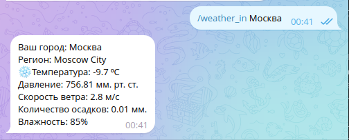

<h1 align="center" style="color: aqua">Weather Bot </h1>
<h2 align="center" style="color: aquamarine">Telegram Bot для уточнения прогноза погоды в определёном городе и рассылки уведомлений</h2>

<h3 style="color: red">Используемый стек технологий:</h3>
<li>Java 17</li>
<li>Spring Boot Web</li>
<li>Spring Boot JPA</li>
<li>Lombok</li>
<li>Liquibase</li>
<li>PostgreSQL</li>
<li>Docker</li>

<p>Для получения прогноза погоды используется API сервера <a href="https://www.weatherapi.com/">Weatherapi</a></p>


<h4>В боте реализованы следующие команды:</h4>
<p>

```
    /start - запускает бота
    /weather_in [Город] - показать погоду в Вашем городе
    /subscribe [Город] - подписка на рассылку погоды
    /unsubscribe - отписка от рассылки уведомлений
```

</p>
<h3>Команда <strong style="color: green">/start</strong> - запуск бота</h3>

<h3>Команда <strong style="color: green">/weather_in Москва</strong> - показ прогноза погоды в городе</h3>

<h3>Команда <strong style="color: green">/subscribe Москва</strong> - подписка на прогноз погоды в городе </h3>

<h3>Команда <strong style="color: green">/unsubscribe</strong> - отписка уведомлений о прогнозе погоды </h3>

<p>Данный бот был успешно развернут на сервере <a href="https://cloud.amvera.ru/">Amvera</a></p>


